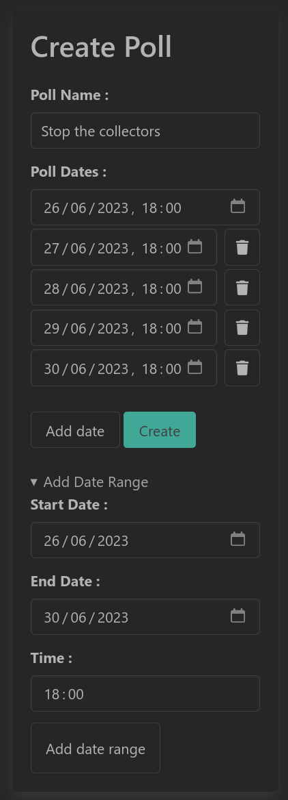
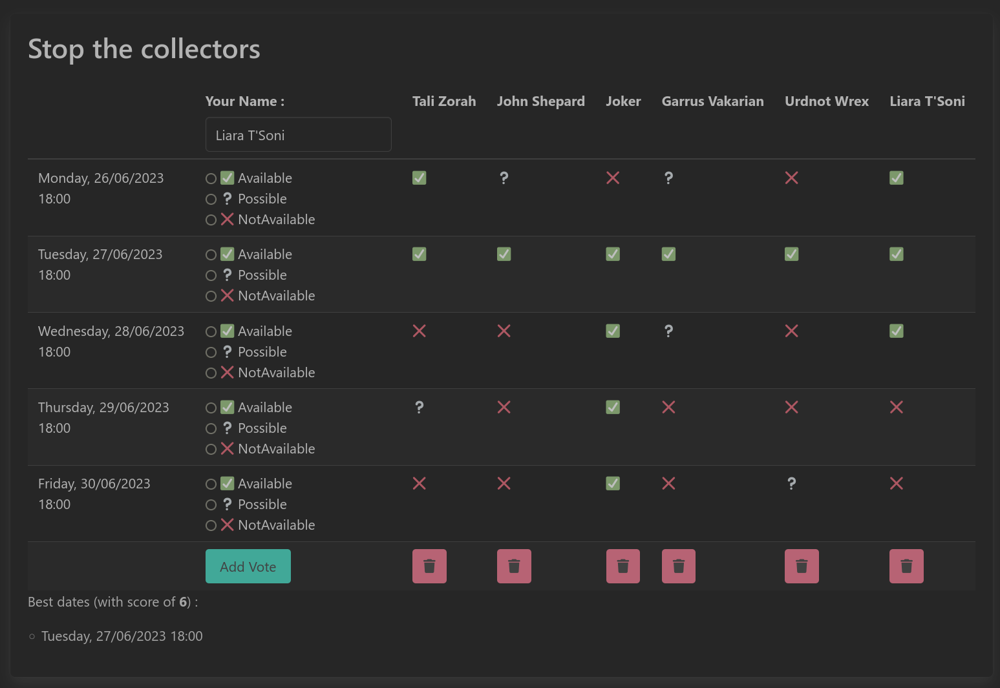
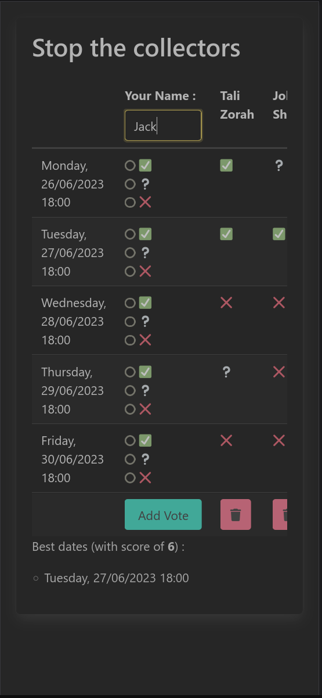

# Planificateur

## Purpose

The purpose of Planificateur is to allow groups to schedule events in a streamlined fashion.

I started this project because existing FOSS apps with this purpose had limitations that did not fit my use-case : 

- Usable on mobile
- Have a ReST API
- Automatable

## Features

- Schedule events for groups, find the best date for everyone
- Mobile-friendly, lightweight UI
- ReST API

## Roadmap

- Cross-platform client app for mobile & desktop
- Automation capabilities : recurring polls, messaging integration

## Tech Stack

Code : 

- C# 11 & .NET 7
- Typescript
- ASP .NET Core & ASP .NET Core MVC
- Entity Framwork Core
- PostgreSQL

Tooling : 

- Docker
- Playwright
- Powershell Core

## Run with Docker 

```yml
  planificateur:
      ports:
          - '5000:80'
      environment:
          - DB_HOST=postgres
          - DB_NAME=planificateur-test
          - DB_PASSWORD=password
          - DB_PORT=5432
          - DB_USERNAME=postgres
          - JWT_SECRET=this-is-a-secret-dont-tell-anyone
      image: ombrelin/planificateur
```

## Run from sources

Requirement : 

- .NET 7 SDK
- Node JS

```bash
cd src/Planificateur.Web
dotnet run
```

# Screenshots





